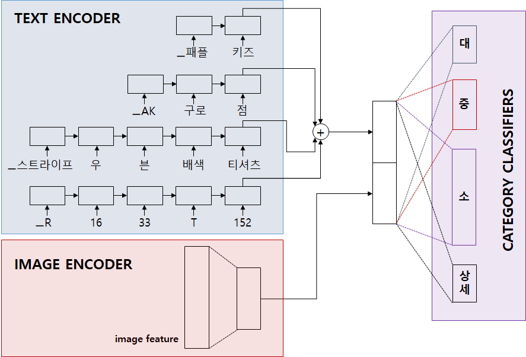

# 상품 카테고리 분류기

[카카오 아레나 - 쇼핑몰 상품 카테고리 분류 대회](https://arena.kakao.com/c/1)에 참여해 1등의 성적을 거둔 라임로봇팀의 오픈 소스코드입니다.



본 분류기는 상품의 타이틀(product 컬럼)과 이미지 특징(img_feat 컬럼)을 입력으로 활용하여 대/중/소/세 카테고리를 예측합니다. 
모델 구조의 심플함에 비해 우수한 카테고리 분류 정확도를 가집니다.

실제로 탈락자(대회 규정위반 사유)를 포함한 순위에서 1등-2등 점수 격차가, 2등-6등 사이의 점수 격차의 평균보다 **3배 이상 월등하면서도 모델 사이즈가 상대적으로 작음**을 확인하였습니다.

+ Rank 1. 라임로봇 1.08592012339 - 0.923/0.876/0.866/0.889 (대/중/소/세)
+ Rank 2. baseIine 1.07861262092 - 0.916/0.869/0.862/0.883
+ Rank 3. S2Bstar 1.07685588927 - 0.918/0.871/0.861/0.875
+ Rank 4. 제로 1.07406150131 - 0.916/0.869/0.858/0.873
+ Rank 5. 송골매 1.07268350441 - 0.913/0.865/0.852/0.880
+ Rank 6. 박준우 1.07003152658 - 0.910/0.862/0.853/0.877


## Requirements
Ubuntu 16.04, Python 3.6, pytorch 1.0에서 실행을 확인하였습니다.

CPU 코어 6개 / 메모리 32G / GTX1080 8GB / 저장공간 450GB의 장비가 필요합니다.

필요한 패키지는 아래의 명령어로 설치할 수 있습니다.
```bash
pip install -r requirements.txt
```

## Getting Started

### Step 1: 데이터 다운로드
작업 디렉터리(예시:`kakao_arena/`) 하위 디렉터리에 `dataset/` 디렉터리를 생성하고, [카카오 아레나 - 쇼핑몰 상품 카테고리 분류 대회의 데이터](https://arena.kakao.com/c/1/data)를 다운로드 받습니다. 약 100GB정도의 저장 공간이 사용됩니다.

본 소스코드(product-categories-classification)도 작업 디렉터리 하위에 위치시킵니다.

```
kakao_arena/
├── dataset/
│   ├── train.chunk.01
│   ├── train.chunk.02
│   ├── train.chunk.03
│   ├── ...
│   └── test.chunk.01
└── product-categories-classification/
    ├── utils/
    ├── doc/
    ├── train.py
    ├── ...
    └── inference.py
```

### Step 2: 데이터 준비 및 Vocabulary 생성
다운로드 받은 dataset으로부터 학습을 위해 필요한 파일을 생성해 냅니다. 약 250GB정도의 저장 공간이 사용됩니다.


#### 1. `train.h5`, `dev.h5`, `test.h5` 생성하기
```bash
python preprocess.py make_db train
python preprocess.py make_db dev
python preprocess.py make_db test
```

생성이 끝나게 되면 아래 처럼 `data/` 디렉터리 내에 3개의 파일이 생성되어 위치하게 됩니다.
```
product-categories-classification/
└── data/
    ├── train.h5
    ├── dev.h5
    └── test.h5
```

#### 2. Vocabulary 생성하기
```bash
python preprocess.py build_vocab train
```

학습에 필요한 사전파일을 `data/vocab/` 디렉터리 내에 생성합니다. 

+ `data/vocab/spm.model` : sentencepiece로 생성된 BPE 모델 파일입니다.
    
    상품의 title은 여러 개의 words로 구성됩니다. word를 index로 치환하는 과정에서 필연적으로 unknown word 문제를 접하게 됩니다. unknown word 문제를 완화하기 위한 방법으로 한 word를 여러 개의 작은 sub-words로 쪼개는 방법이 제안 되었습니다. 최근 널리 사용되는 방법으로 [Byte Pair Encoding (BPE)](https://github.com/rsennrich/subword-nmt)가 있습니다. BPE를 사용하기 쉽도록 한 패키지로 [sentencepiece](https://github.com/google/sentencepiece)(일종의 토크나이저)가 있습니다. `spm.model`은 sentencepiece로부터 만들어진 모델 파입니다.
        
+ `data/vocab/wp_vocab.txt` : word를 여러 개의 sub-words로 쪼갠 다음 sub-word를 index로 치환하기 위해 필요한 사전파일입니다.
+ `data/vocab/y_vocab.txt` : 대>중>소>상세를 index로 치환하기 위해 필요한 사전파일입니다.
+ `data/vocab/spm.vocab` : sentencepiece로 생성된 사전파일이나 사용되지 않습니다. 
+ `data/vocab/train_title.txt` : `spm.model` 파일을 생성하기 위한 중간 파일로 사용되지 않습니다.


### Step 3: 학습하기
```bash
python train.py -j 12 -b 2048 --hidden_size 700 --prefix h700_d0.3_ 
```
+ `-j`: dataloader에서 사용할 worker의 개수를 지정합니다.
+ `-b`: batch size를 지정합니다.
+ `--emb_size` : Text embedding 크기를 지정합니다. 디폴트는 200입니다.
+ `--hidden_size` : model의 hidden units의 크기를 지정합니다.
+ `--lr`: learning rate를 지정합니다. 디폴트는 0.001입니다.
+ `--prefix` : model을 저장할 때 기본 이름의 앞에 붙일 prefix를 지정합니다. model은 `output/`에 저장됩니다.
+ `--resume` : 학습이 중단됐을 때, 바로 중단된 epoch부터 재시작할 수 있습니다. `output/` 디렉터리에 저장된 model 파일을 지정합니다.

이 외에 옵션은 `config.json` 파일에서 확인하시기 바랍니다.

CPU 코어 8개 / 메모리 32G / GPU 메모리가 14G 이상일 경우 아래의 명령어를 사용하면 학습이 더 빨리 종료됩니다. 
```bash
python train.py -j 16 -b 8192 --hidden_size 700 --prefix h700_d0.3_ 
```

#### 모델의 크기 줄이기
model을 저장할 때 학습 재개를 고려하여 optimizer의 파라미터도 함께 저장합니다. 그러나 실제 추론 inference에선 필요 없으므로 optimizer의 파라미터는 제거할 수 있습니다. 
```bash
python utils/remove_opt_params.py --model ../output/best_h700_d0.3_it2vec.pth.tar
```

### Step 4: 추론하기
```bash
python inference.py -j 12 -b 2048 --model_dir output/ --div dev
```
`--model_dir`로 지정된 디렉터리에 있는 `best*.tar` 형식의 모든 model 파일들을 로딩합니다. 로딩된 모든 model들은 앙상블 결합돼 inference에 활용됩니다.

+ `-j` : dataloader에서 사용할 worker의 개수를 지정합니다.
+ `-b` : batch size를 지정합니다.
+ `--model_dir` : model이 저장된 디렉터리를 지정합니다.
+ `--div` : dev 또는 test로 지정할 수 있습니다.

#### pre-trained models
아래 model들은 다른 하이퍼파라미터는 고정하고 hidden_size만 변경하여 학습된 model들입니다.

| 모델 이름 | 파일 크기| Dev score |
|:---:|:---:|:---:|
|[best_h700_d0.3_it2vec.pth.tar](https://www.dropbox.com/s/aa1vk61c0pphlj9/best_h700_d0.3_it2vec.pth.tar?dl=0)| 61.85MB | 1.069? |
|[best_h800_d0.3_it2vec.pth.tar](https://www.dropbox.com/s/f76otyd2nfnhlwp/best_h800_d0.3_it2vec.pth.tar?dl=0)| 73.70MB | 1.0707 |
|[best_h900_d0.3_it2vec.pth.tar](https://www.dropbox.com/s/785ktor5dwzoxjt/best_h900_d0.3_it2vec.pth.tar?dl=0)| 86.73MB | 1.0717 |
|[best_h1000_d0.3_it2vec.pth.tar](https://www.dropbox.com/s/s5whaim2lo4zljd/best_h1000_d0.3_it2vec.pth.tar?dl=0)| 101.07MB | 1.0722 |
|[best_h1100_d0.3_it2vec.pth.tar](https://www.dropbox.com/s/pdz7r20kjy0syyp/best_h1100_d0.3_it2vec.pth.tar?dl=0)| 116.59MB | 1.07? |
|[best_h1200_d0.3_it2vec.pth.tar](https://www.dropbox.com/s/eoch17ody1bhod4/best_h1200_d0.3_it2vec.pth.tar?dl=0)| 133.32MB | 1.07? |

위 model들의 묶음 [output](https://www.dropbox.com/s/pj1x0yhuuqdet4a/output.zip?dl=0)을 다운로드 받을 수 있습니다.
hidden_size를 늘릴수록 dev score가 증가하는 것을 확인하였으나, 아쉽게도 h800, h900, h1000을 제외하곤 dev score를 확인하지 못하였습니다.

| 앙상블 결합 | 파일 크기 | Dev score | Test score |
| :---: | :---: | :---: | :---: |
|700, 800, 900, 1000 | 323.35MB | 1.082713 | |
|700, 800, 900, 1000, 1100, 1200 | 573.26MB | 1.084474 | 1.085920 |


## Quick Reproduce
### 1) Vocabulary 다운로드
[vocab.zip 파일](https://www.dropbox.com/s/r0ap1eija4i91hu/vocab.zip?dl=0)을 다운로드 받아 `data/` 디렉터리에서 압축을 해제합니다.

### 2) `dev.h5`, `test.h5` 생성
```bash
python preprocess.py make_db dev
python preprocess.py make_db test
```


위 두 단계 수행 후 아래처럼 디렉터리와 파일이 구성되면 됩니다.
```
product-categories-classification/
├── output/
└── data/
    ├── vocab/
    │   ├── spm.model
    │   ├── wp_vocab.txt
    │   └── y_vocab.txt
    ├── dev.h5
    └── test.h5
```

### 3) pre-trained modes 다운로드
[6개 모델 묶음](https://www.dropbox.com/s/pj1x0yhuuqdet4a/output.zip?dl=0)을 다운로드하여 `output/` 디렉터리에 압축을 풀어줍니다.

### 4) 결과파일(`dev.tsv`, `test.tsv`) 생성
```bash
python inference.py -j 12 -b 2048 --model_dir output/ --div dev
python inference.py -j 12 -b 2048 --model_dir output/ --div test
```


## Features
+ 상품의 타이틀(product 컬럼)과 이미지 특징(img_feat 컬럼)만 입력으로 활용
+ Byte Pair Encoding (BPE) 기반의 word 분절 방법 사용
+ sub-words로 분절된 word를 LSTM으로 encoding 
+ class imbalance problem을 완화하기 위해 대/중/소/세에 개별 classifier 할당
+ 클래스 예측 정교화 - 4개 classifier의 예측된 distributions에서 가장 높은 확률값을 가지는 대/중/소/세 조합을 탐색
